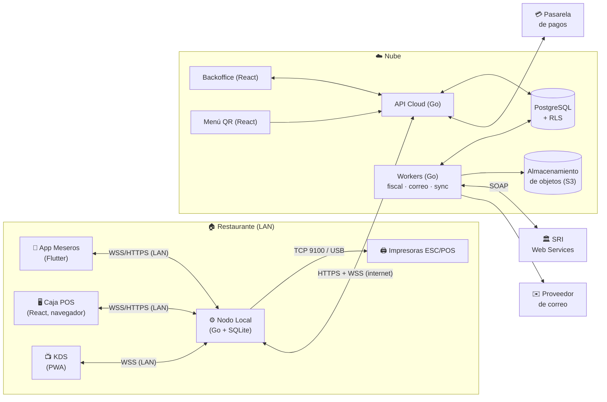
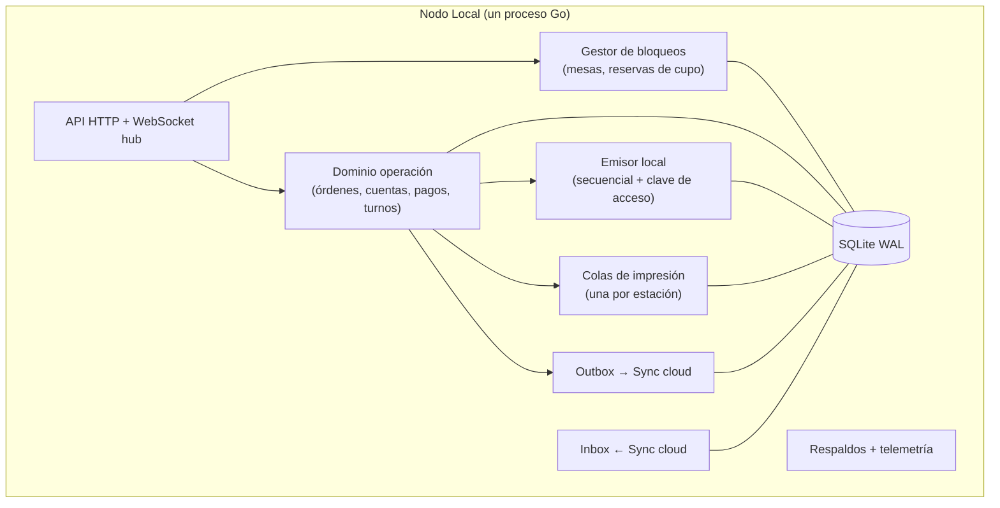
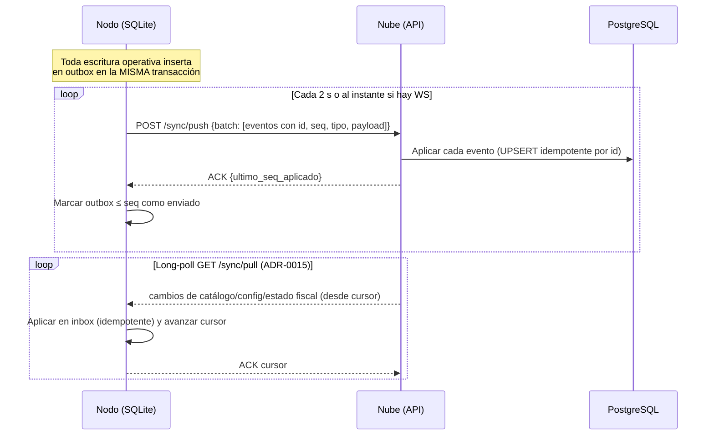

# 03 · Arquitectura del sistema

| Campo | Valor |
|---|---|
| Estilo | SaaS multi-tenant **Cloud-Edge híbrido**, orientado a eventos |
| Decisiones relacionadas | [ADR-0001](adr/0001-monorepo.md) … [ADR-0008](adr/0008-multitenancy-rls.md) |

## 1. Vista de contexto (C4 nivel 1)



## 2. Componentes (C4 nivel 2)

| Componente | Tecnología | Responsabilidad | Se ejecuta en |
|---|---|---|---|
| **API Cloud** | Go (`net/http` + chi), pgx, sqlc | API REST del backoffice, sincronización con nodos, auth, entitlements, SSE para el dashboard | Contenedor en la nube |
| **Workers** | Go, cola sobre PostgreSQL (River) | Motor fiscal (XML, firma, envío, autorización), RIDE PDF, correos, procesos programados | Contenedor en la nube |
| **PostgreSQL** | PostgreSQL 16+ | Fuente de verdad central, RLS por tenant | Servicio administrado |
| **Almacenamiento de objetos** | Azure Blob Storage (ADR-0013) | XML autorizados (inmutables, comprimidos), imágenes, respaldos cifrados | Nube |
| **Nodo Local** | Go (binario único), SQLite (WAL) | Servidor LAN: API + WebSocket, bloqueos, secuenciales, impresión, cola de sincronización, respaldos, KDS estático | PC de caja (servicio del SO) |
| **App Meseros** | Flutter (Cupertino), drift (SQLite), Riverpod | Toma de pedidos offline-first | Android / iOS |
| **Caja POS** | React + TS + Vite (PWA) | Cobro, división de cuentas, turnos | Navegador en la PC de caja (servida por el Nodo Local) |
| **Backoffice** | React + TS + Vite | Configuración, reportes, inventario, SRI | Navegador (servido desde CDN) |
| **KDS** | React PWA | Pantalla de cocina | Tablet (servido por el Nodo Local) |
| **Menú QR** | React (SSR opcional) | Menú público | CDN |

> **Decisión clave:** la **Caja POS la sirve el Nodo Local** (`http://nodo.local`) y habla con él por la LAN, igual que la app. Así la caja funciona sin internet. El **Backoffice** vive en la nube y requiere internet.

## 3. Propiedad de los datos (quién manda sobre qué)

Esta es la regla que elimina los conflictos de sincronización (hallazgo X-09).

| Dominio | Dueño (escribe) | Réplica (lee) | Dirección de sync |
|---|---|---|---|
| Tenant, planes, entitlements | Nube | Nodo | Nube → Nodo |
| Catálogo: categorías, productos, precios, modificadores, recetas, impuestos | Nube (backoffice) | Nodo, App | Nube → Nodo → App |
| Configuración: mesas, zonas, estaciones, impresoras (asignación) | Nube | Nodo | Nube → Nodo |
| Descubrimiento de impresoras (hardware detectado) | Nodo | Nube | Nodo → Nube |
| Personal, PIN hash, permisos, dispositivos | Nube | Nodo | Nube → Nodo |
| **Operación**: órdenes, líneas, comandas, cuentas, pagos, turnos, jornadas, Cierre Z | **Nodo** | Nube | Nodo → Nube |
| **Secuenciales** por punto de emisión y **clave de acceso** | **Nodo** | Nube | Nodo → Nube |
| **Estado fiscal** (enviado, autorizado, errores) | Nube | Nodo | Nube → Nodo |
| Kardex: movimientos por venta y cupos diarios | Nodo | Nube | Nodo → Nube |
| Kardex: compras, producción, tomas físicas (desde el backoffice) | Nube | Nodo | Nube → Nodo |
| Auditoría | Quien la genera | Nube | Nodo → Nube |
| Clientes (compradores) | Ambos (merge) | Ambos | Bidireccional, *last-writer-wins* por campo con reloj de versión |

**Consecuencia:** salvo en *clientes*, **nunca hay dos escritores** para el mismo registro, así que no hay conflictos que resolver. Un cambio de precio en la nube llega al nodo como una **nueva versión** del producto; las líneas de órdenes ya tomadas guardan una **copia** del precio y el impuesto en el momento de la venta (*snapshot*), por lo que no cambian.

## 4. Nodo Local: diseño interno



- **Un solo escritor:** SQLite con WAL, una conexión de escritura serializada (goroutine dedicada) y un pool de lectores. Esto garantiza la atomicidad de bloqueos, reservas y secuenciales sin locks distribuidos.
- **Bloqueos de mesa y reservas:** estado en memoria **y** en SQLite (para sobrevivir a un reinicio), con expiración por heartbeat (mesa 45 s, reserva 10 min).
- **Pragmas:** `journal_mode=WAL`, `synchronous=FULL` (las escrituras fiscales no pueden perderse ante un corte de luz), `foreign_keys=ON`, `busy_timeout=5000`.
- **Purga:** los datos operativos de más de 60 días (ya sincronizados y confirmados) se purgan. Nunca se purga lo que no está sincronizado.

## 5. Sincronización Edge ↔ Cloud

**Patrón:** *Transactional Outbox* + *Inbox* idempotente + cursores por flujo.



Reglas:

1. **Eventos con UUIDv7** y número de secuencia monotónico por nodo (`node_seq`).
2. **Idempotencia:** la nube guarda `(node_id, node_seq)` procesados; reenviar no tiene efecto.
3. **Orden:** los eventos se aplican en orden de `node_seq` por agregado (una orden y sus líneas).
4. **Versionado de esquema de eventos:** cada evento lleva `type` y `version`; la nube acepta N y N-1.
5. **Backpressure:** lotes de hasta 500 eventos o 1 MB.
6. **Reconexión:** al reconectar, se empuja el outbox pendiente **antes** de aceptar cambios de catálogo que puedan invalidar precios en curso.
7. **Monitoreo:** tamaño del outbox, edad del evento más antiguo sin confirmar y alertas.

## 6. Contratos y versionado de APIs

| Interfaz | Contrato | Versionado |
|---|---|---|
| API Cloud (REST) | OpenAPI 3.1 en `contracts/openapi/` | Prefijo `/v1`; cambios compatibles hacia atrás dentro de v1 |
| API Nodo (REST LAN) | OpenAPI 3.1 | `/v1` |
| WebSocket (Nodo ↔ clientes) | JSON Schema por mensaje en `contracts/events/` | Campo `v` en cada mensaje |
| Sync (Nodo ↔ Cloud) | JSON Schema | `type` + `version` por evento |

Los clientes (Dart y TypeScript) y los tipos de Go **se generan** desde los contratos para eliminar desalineaciones.

Formato de mensaje WebSocket:

```json
{ "v": 1, "id": "0192…", "type": "table.locked", "ts": "2026-09-24T21:15:03.120-05:00",
  "data": { "table_id": "0192…", "by_user_id": "0192…", "by_name": "Carlos" } }
```

Catálogo inicial de eventos: `table.lock.request`, `table.locked`, `table.unlocked`, `table.heartbeat`, `table.state_changed`, `order.submitted`, `order.line_voided`, `stock.reserve`, `stock.released`, `stock.changed`, `kitchen.ticket_ready`, `printer.status`, `user.deactivated`, `device.revoked`, `catalog.updated`, `fiscal.status_changed`.

## 7. Punto único de falla: el Nodo Local

El Nodo Local es crítico. Mitigaciones:

1. Servicio del SO con reinicio automático y *watchdog*.
2. Recomendación comercial: **UPS** para la PC de caja y el router (incluida en el kit de instalación).
3. Arranque en ≤ 10 s tras un reinicio; los clientes reconectan solos (backoff).
4. **Plan de contingencia documentado** para el restaurante: si el nodo cae, se usan comandas en papel y se cobran luego. La caja puede operar como "modo emergencia" desde otro PC con un nodo de respaldo **solo** tras revocar el anterior (evita duplicar secuenciales).
5. Futuro (C): nodo secundario en espera (*hot standby*) con replicación, para el plan Pro.

## 8. Distribución y actualización

| Artefacto | Canal | Firma | Estrategia |
|---|---|---|---|
| Nodo Local | Servidor de actualizaciones propio (manifest + binarios) | Firma de código (Authenticode en Windows) + firma del manifest (ed25519) | Anillos: interno → piloto → 10 % → 100 %; ventana fuera de servicio; rollback automático |
| App Meseros | Google Play / App Store (y APK directo para tablets administradas) | De la tienda | Versión mínima soportada forzada por la API |
| Web (POS/KDS) | Empaquetada **dentro** del binario del Nodo Local | Del binario | Se actualiza con el nodo |
| Backoffice / Menú QR | CDN | — | Despliegue continuo |
| API / Workers | Registro de contenedores | — | *Rolling* o *blue-green*, migraciones compatibles *expand/contract* |

## 9. Almacenamiento, retención y respaldos

| Dato | Dónde | Retención |
|---|---|---|
| XML autorizados | Blob `comprobantes` (GRS, inmutable/WORM): un blob por emisor por día, cada factura comprimida con diccionario zstd, índice en PostgreSQL (ADR-0013) | ≥ 7 años (verificar). Hot 30 d → Cool → Cold |
| XML reciente | PostgreSQL | 90 días |
| RIDE PDF | **No se guarda**: se genera desde el XML al pedirlo | — |
| Copia local de comprobantes | Nodo Local (SQLite) | 90 días |
| PDFs temporales en el nodo | Disco local | Se borran tras confirmar la subida |
| Datos operativos en el nodo | SQLite | 60 días (solo si ya están sincronizados) |
| Respaldo cifrado del nodo | Blob `respaldos/<tenant>/<local>/` (LRS, Cool) + USB/segundo disco opcional | 7 diarios + 4 semanales (USB: últimos 7) |
| Respaldo de PostgreSQL | PITR de Azure PostgreSQL Flexible | 7 días de PITR (hasta 35) + exportación mensual por 12 meses |
| Imágenes del menú | Blob `media` (LRS) + caché en el Nodo Local (WebP, varias resoluciones) | Mientras exista el producto |
| Logs de aplicación | Log Analytics | 30 días |
| Auditoría | PostgreSQL (append-only) | ≥ 7 años |

Costos y volúmenes medidos: [`13-almacenamiento-y-costos-azure.md`](13-almacenamiento-y-costos-azure.md).

## 10. Observabilidad

- **Logs:** JSON estructurado (`slog` en Go) con `trace_id`, `tenant_id`, `local_id`, `node_id` y `user_id` (UUID, nunca nombres ni cédulas).
- **Métricas:** OpenTelemetry. Métricas clave: latencia de comanda, trabajos de impresión fallidos, tamaño del outbox, comprobantes por estado y antigüedad, errores del SRI por código, conexiones WS activas.
- **Trazas:** OpenTelemetry desde la API hasta los workers y el SRI.
- **Salud del nodo:** heartbeat cada 60 s con versión, uso de disco, outbox, impresoras y reloj (la **deriva del reloj** importa porque la fecha va en la clave de acceso; se sincroniza por NTP y se alerta si difiere más de 60 s).
- **Alertas:** nodo sin reportar más de 10 min en horario de servicio; comprobantes sin autorizar más de 12 h; tasa de errores 5xx en la API; certificado P12 por vencer.

## 11. Entornos

| Entorno | Propósito | SRI | Datos |
|---|---|---|---|
| `local` | Desarrollo (docker compose: Postgres, MinIO, Mailpit, simulador de impresora, stub del SRI) | Stub | Sintéticos |
| `dev` | Integración continua de `main` | Pruebas (ambiente 1) | Sintéticos |
| `staging` | Pre-producción, pruebas E2E y de carga | Pruebas (ambiente 1) | Sintéticos o anonimizados |
| `prod` | Producción | Según el tenant (1 o 2) | Reales |

## 12. Estructura del monorepo (objetivo)

```
/
├── apps/
│   ├── cloud-api/          # Go: API + workers (cmd/api, cmd/worker)
│   ├── edge-node/          # Go: Nodo Local (embebe pos-web y kds-web)
│   ├── waiter-app/         # Flutter: App de meseros
│   ├── pos-web/            # React: Caja
│   ├── backoffice-web/     # React: Panel administrativo
│   ├── kds-web/            # React: KDS
│   └── menu-web/           # React: Menú QR
├── packages/
│   ├── go/                 # Librerías Go compartidas (dominio, sri, escpos, money, ids)
│   ├── ts/                 # Librerías TS compartidas (ui-kit, api-client generado)
│   └── dart/               # Cliente Dart generado
├── contracts/
│   ├── openapi/            # Contratos REST
│   └── events/             # JSON Schemas de eventos WS y sync
├── db/
│   ├── cloud/migrations/   # Migraciones PostgreSQL
│   └── edge/migrations/    # Migraciones SQLite
├── tools/                  # Simulador de impresora, stub SRI, generadores
├── e2e/                    # Cypress (web), k6 (carga)
├── deploy/                 # Dockerfiles, IaC
└── docs/                   # Esta documentación
```
