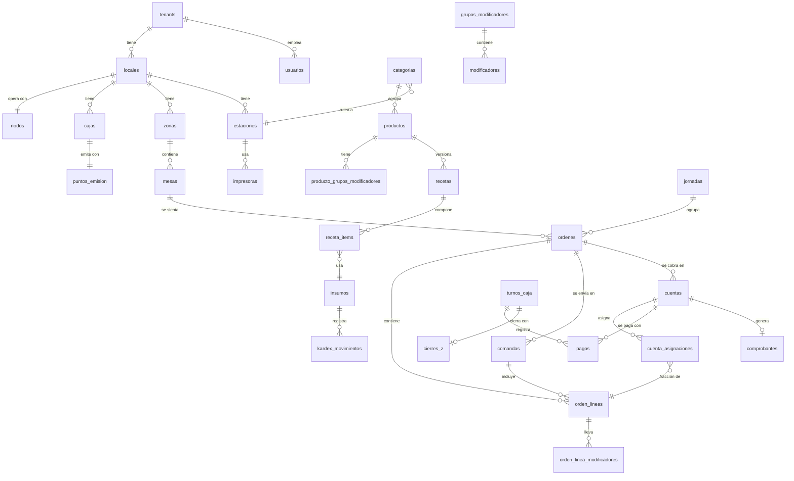

# 04 · Modelo de datos

> Modelo **lógico** consolidado. Las migraciones físicas (`db/cloud/migrations`, `db/edge/migrations`) son la fuente de verdad una vez creadas; este documento debe actualizarse **en el mismo PR** que cambie el esquema.

## 1. Convenciones

| Regla | Detalle |
|---|---|
| Nombres | `snake_case`, tablas en plural, en español (dominio del negocio). |
| Clave primaria | `id UUID` **v7**, generado por quien crea el registro (nube, nodo o app). Nunca autoincrementales. |
| Multi-tenant | Toda tabla de negocio tiene `tenant_id UUID NOT NULL` + política RLS. Las tablas de operación también llevan `local_id`. |
| Auditoría de fila | `created_at timestamptz`, `updated_at timestamptz`, `created_by UUID`, `version INT` (control optimista y sync). |
| Borrado | Lógico (`deleted_at`) en maestros. **Prohibido** en operación, fiscal, kardex y auditoría (append-only). |
| Dinero | `NUMERIC(12,2)` para importes; `NUMERIC(18,6)` para precio unitario (el SRI admite hasta 6 decimales). |
| Cantidades | `NUMERIC(14,4)` para inventario; `NUMERIC(10,3)` para cantidades vendidas (admite fracciones por división de cuentas). |
| Tiempo | `timestamptz` en UTC; la zona horaria del local se usa solo para presentación y fecha de negocio. |
| Enums | Tipos `ENUM` de PostgreSQL o `TEXT` + `CHECK`; en SQLite, `TEXT` + `CHECK`. |
| Snapshots | Las líneas de venta y los comprobantes copian nombre, precio e impuesto del producto **en el momento** de la venta. |
| JSON | `JSONB` solo para datos semiestructurados sin integridad referencial (p. ej. payload de eventos). Los modificadores de línea van en **tabla propia** (se necesitan para recetas y reportes). |

## 2. Diagrama entidad-relación (núcleo)



## 3. Plataforma y seguridad

### `tenants`
| Columna | Tipo | Regla |
|---|---|---|
| id | UUID PK | |
| ruc | CHAR(13) | Único entre los tenants activos |
| razon_social, nombre_comercial | TEXT | |
| plan_id | UUID FK → `planes` | |
| estado_suscripcion | ENUM `PRUEBA`, `ACTIVA`, `EN_GRACIA`, `SUSPENDIDA`, `CANCELADA` | |
| config | JSONB | Preferencias no críticas |

### `planes` · `plan_funciones`
Define los límites y los *feature flags* (RF-09-01).

### `locales`
`id`, `tenant_id`, `nombre`, `direccion`, `codigo_establecimiento CHAR(3)`, `zona_horaria`, `propina_legal_activa BOOL`, `propina_porcentaje NUMERIC(5,2) DEFAULT 10`, `precios_incluyen_iva BOOL`.

### `nodos`
`id` (UUID v7 generado por el nodo), `tenant_id`, `local_id` (único entre los nodos activos), `nombre_equipo`, `estado ENUM(ACTIVO, REVOCADO)`, `llave_publica` (ed25519, 32 bytes; la privada no sale del nodo, ADR-0014), `version_software`, `ultimo_heartbeat_at`, `heartbeat JSONB` (última telemetría), `activado_at`, `activado_por`, `revocado_at`.

### `usuarios`
| Columna | Tipo | Regla |
|---|---|---|
| id | UUID PK | |
| tenant_id | UUID FK | RLS |
| nombre_mostrar | TEXT | "Carlos M." |
| rol | ENUM `ADMIN`, `CAJERO`, `MESERO`, `COCINA`, `BODEGA` | |
| email | CITEXT NULL | Obligatorio para `ADMIN` y para `CAJERO` con acceso web |
| password_hash | TEXT NULL | Argon2id. Nulo para roles solo-PIN |
| pin_hash | TEXT NULL | HMAC-SHA256 (pepper del servidor) + Argon2id. Obligatorio para roles operativos |
| pin_fingerprint | TEXT NULL | HMAC determinístico para validar la unicidad del PIN por local sin revelarlo |
| avatar_url | TEXT NULL | |
| activo | BOOL | |
| totp_secret_cifrado | BYTEA NULL | 2FA |

### `usuario_locales`
Relación N:M de usuarios con locales (un mesero puede trabajar en dos sucursales).

### `permisos_usuario`
`usuario_id`, `permiso TEXT` (catálogo: `ANULAR_ITEM_ENVIADO`, `DAR_DESCUENTO`, `ABRIR_CAJON`, `COBRAR`, `DIVIDIR_CUENTA`, `EMITIR_NC`, `RECARGAR_CUPO`…), `concedido BOOL`. *Modelo de filas y no de columnas, para añadir permisos sin migraciones.*

### `dispositivos`
`id`, `tenant_id`, `local_id`, `nombre`, `tipo ENUM(MOVIL, TABLET, KDS, POS)`, `llave_publica`, `plataforma`, `version_app`, `estado ENUM(AUTORIZADO, REVOCADO)`, `emparejado_at`, `ultimo_uso_at`.

### `tokens_emparejamiento` · `codigos_activacion_nodo`
Tokens de un solo uso con expiración (`expira_at`, `usado_at`). `codigos_activacion_nodo` guarda solo `codigo_hash`, el `local_id` y el `nodo_id` que lo canjeó.

### `sesiones` · `revocaciones`
Refresh tokens (hash) ligados a usuario + dispositivo; lista de revocación de JTI.

## 4. Catálogo

- **`categorias`**: `id`, `tenant_id`, `nombre`, `orden`, `estacion_id` (ruteo por defecto), `color`, `icono`, `activa`.
- **`productos`**: `id`, `tenant_id`, `categoria_id`, `nombre`, `alias`, `descripcion`, `precio NUMERIC(18,6)`, `tarifa_iva_id`, `tipo ENUM(SIMPLE, RECETA, PREPARACION, INSUMO_VENDIBLE)`, `comportamiento_stock ENUM(NINGUNO, PERMANENTE, DIARIO)`, `estacion_id NULL` (sobrescribe la de la categoría), `imagen_key`, `activo`, `visible_menu_qr`.
- **`producto_precios_local`** (S): precio distinto por local.
- **`grupos_modificadores`**: `id`, `nombre`, `obligatorio`, `min`, `max`.
- **`modificadores`**: `id`, `grupo_id`, `nombre`, `precio_adicional`, `receta_id NULL`.
- **`producto_grupos_modificadores`**: N:M con `orden`.
- **`notas_rapidas`**: `categoria_id`, `texto`.
- **`tarifas_iva`**: `id`, `codigo_sri` (código de porcentaje de la ficha técnica), `porcentaje`, `descripcion`, `vigente_desde`, `vigente_hasta`. *Tabla global, no por tenant.*

## 5. Salón y hardware

- **`zonas`**: `id`, `local_id`, `nombre`, `orden`.
- **`mesas`**: `id`, `local_id`, `zona_id`, `nombre`, `capacidad`, `forma`, `pos_x`, `pos_y`, `rotacion`, `ancho`, `alto`, `activa`. *El estado vivo (libre/ocupada/bloqueada) **no** se guarda aquí; se deriva de la orden abierta y del gestor de bloqueos del nodo.*
- **`bloqueos_mesa`** (solo en el nodo): `mesa_id PK`, `usuario_id`, `dispositivo_id`, `adquirido_at`, `ultimo_heartbeat_at`.
- **`estaciones`**: `id`, `local_id`, `nombre`, `tipo ENUM(PRODUCCION, CAJA)`.
- **`impresoras`**: `id`, `local_id`, `nombre`, `conexion ENUM(TCP, USB)`, `host`, `puerto`, `mac`, `usb_id`, `ancho_papel ENUM(58,80)`, `estado`, `ultimo_estado_at`.
- **`estacion_impresoras`**: N:M (una estación puede imprimir en dos impresoras).
- **`trabajos_impresion`** (solo en el nodo): `id`, `impresora_id`, `tipo`, `payload BLOB`, `estado ENUM(PENDIENTE, ENVIANDO, IMPRESO, ERROR)`, `intentos`, `ultimo_error`.

## 6. Operación (dueño: Nodo Local)

- **`jornadas`**: `id`, `local_id`, `fecha_negocio DATE`, `abierta_at`, `cerrada_at`, `abierta_por`, `cerrada_por`.
- **`cajas`**: `id`, `local_id`, `nombre`, `punto_emision_id`.
- **`turnos_caja`**: `id`, `caja_id`, `jornada_id`, `cajero_id`, `fondo_inicial`, `abierto_at`, `cerrado_at`, `estado ENUM(ABIERTO, CERRADO)`.
- **`movimientos_caja`**: `id`, `turno_id`, `tipo ENUM(RETIRO, INGRESO, GASTO)`, `monto`, `motivo`, `usuario_id`.
- **`ordenes`**:

| Columna | Tipo | Regla |
|---|---|---|
| id | UUID PK | Generado en la app o el nodo |
| tenant_id, local_id, jornada_id | UUID | |
| tipo | ENUM `MESA`, `LLEVAR`, `BARRA`, `DELIVERY` | |
| mesa_id | UUID NULL | Obligatorio si `tipo = MESA` |
| mesero_id | UUID | Dueño actual de la orden |
| numero_corto | INT | Número visible por jornada (asignado por el nodo) |
| estado | ENUM `ABIERTA`, `PRECUENTA`, `CERRADA`, `ANULADA` | |
| comensales | SMALLINT NULL | |
| abierta_at, cerrada_at | timestamptz | |
| sync_estado | ENUM `LOCAL`, `SINCRONIZADO` | Solo en el nodo |

- **`orden_lineas`**:

| Columna | Tipo | Regla |
|---|---|---|
| id | UUID PK | Generado en el dispositivo |
| orden_id | UUID FK | |
| producto_id | UUID FK | |
| producto_nombre, precio_unitario, tarifa_iva_id, porcentaje_iva | snapshot | Copia al momento de la venta |
| cantidad | NUMERIC(10,3) | |
| nota | TEXT NULL | Nota libre por línea |
| tiempo | ENUM `BEBIDA`, `ENTRADA`, `FUERTE`, `POSTRE` NULL | |
| estacion_id | UUID | Estación resuelta al enviar (snapshot) |
| comanda_id | UUID NULL | Nulo = aún no enviada |
| estado | ENUM `BORRADOR`, `ENVIADA`, `EN_PREPARACION`, `LISTA`, `ENTREGADA`, `ANULADA` | |
| anulada_por, anulada_motivo, anulada_at, se_preparo | | Si fue anulada tras el envío |
| descuento_monto | NUMERIC(12,2) | |

- **`orden_linea_modificadores`**: `id`, `orden_linea_id`, `modificador_id`, `nombre` (snapshot), `precio_adicional` (snapshot), `cantidad`.
- **`comandas`**: `id`, `orden_id`, `numero` (por jornada), `enviada_por`, `enviada_at`, `idempotency_key UNIQUE`.
- **`cuentas`**: `id`, `orden_id`, `numero` (1..N dentro de la orden), `estado ENUM(ABIERTA, PAGADA)`, `cliente_id NULL`, `subtotal_sin_impuestos`, `descuento_total`, `propina`, `total`.
- **`cuenta_asignaciones`**: `id`, `cuenta_id`, `orden_linea_id`, `fraccion NUMERIC(7,6)` (1 = línea completa; 0,333333 = un tercio), `monto` (calculado con ajuste de centavos).
- **`pagos`**: `id`, `cuenta_id`, `turno_id`, `metodo_pago_id`, `monto`, `recibido` (efectivo entregado), `vuelto`, `referencia`, `ultimos4`, `created_at`.
- **`metodos_pago`**: `id`, `tenant_id`, `nombre`, `codigo_forma_pago_sri`, `abre_cajon BOOL`, `activo`.
- **`cierres_z`**: `id`, `turno_id UNIQUE`, `numero`, `esperado JSONB` (por método), `declarado JSONB`, `diferencias JSONB`, `detalle_denominaciones JSONB`, `generado_at`, `hash`. **Inmutable.**
- **`reservas_cupo`** (solo en el nodo): `id`, `producto_id`, `orden_linea_id`, `cantidad`, `expira_at`.

## 7. Clientes y facturación

- **`clientes`**: `id`, `tenant_id`, `tipo_identificacion ENUM(RUC='04', CEDULA='05', PASAPORTE='06', CONSUMIDOR_FINAL='07', EXTERIOR='08')`, `identificacion`, `razon_social`, `direccion`, `email`, `telefono`, `consentimiento_at`, `version`. Único por `(tenant_id, tipo_identificacion, identificacion)`.
- **`configuracion_fiscal`**: `tenant_id PK`, `ambiente ENUM(PRUEBAS=1, PRODUCCION=2)`, `obligado_contabilidad`, `contribuyente_especial_nro NULL`, `agente_retencion_resolucion NULL`, `regimen ENUM(GENERAL, RIMPE_EMPRENDEDOR, RIMPE_NEGOCIO_POPULAR)`, `direccion_matriz`, `vigente_desde`.
- **`certificados_firma`**: `id`, `tenant_id`, `p12_cifrado BYTEA`, `password_cifrada BYTEA`, `dek_cifrada BYTEA` (llave de datos cifrada por KMS), `titular`, `ruc`, `serial`, `valido_desde`, `valido_hasta`, `activo`.
- **`puntos_emision`**: `id`, `local_id`, `codigo_establecimiento CHAR(3)`, `codigo_punto CHAR(3)`, `ambiente`, `nodo_id` (**único dueño** del secuencial).
- **`secuenciales`** (en el nodo, replicado): `punto_emision_id`, `tipo_comprobante CHAR(2)`, `ambiente`, `ultimo INT`. Se incrementa en la misma transacción del comprobante.
- **`comprobantes`**:

| Columna | Tipo | Regla |
|---|---|---|
| id | UUID PK | |
| tenant_id, local_id, punto_emision_id | UUID | |
| cuenta_id | UUID NULL UNIQUE | 1 cuenta → 1 factura |
| tipo | CHAR(2) | `01` factura, `04` nota de crédito |
| ambiente | SMALLINT | 1 / 2 |
| serie | CHAR(6) | `001001` |
| secuencial | CHAR(9) | |
| clave_acceso | CHAR(49) UNIQUE | |
| fecha_emision | DATE | Fecha en la zona horaria del local |
| cliente snapshot | tipo_id, identificacion, razon_social, direccion, email | |
| subtotales | por tarifa (JSONB estructurado + columnas totales) | |
| total_descuento, propina, importe_total | NUMERIC(12,2) | |
| estado | ENUM `EMITIDO_LOCAL`, `EN_NUBE`, `FIRMADO`, `ENVIADO`, `RECIBIDO`, `AUTORIZADO`, `NO_AUTORIZADO`, `DEVUELTO`, `REQUIERE_ATENCION` | |
| intentos, proximo_intento_at | | Cola fiscal |
| mensajes_sri | JSONB | Respuestas crudas del SRI |
| fecha_autorizacion | timestamptz NULL | |
| xml_key, ride_key | TEXT | Ubicación en el almacenamiento de objetos |
| comprobante_modificado_id | UUID NULL | Para la NC |
| motivo | TEXT NULL | Para la NC |

- **`comprobante_detalles`**, **`comprobante_impuestos`**, **`comprobante_pagos`**: estructura normalizada que se mapea 1:1 al XML.
- **`comprobante_eventos`**: historial de transiciones de estado (append-only).

## 8. Inventario

- **`unidades`**: `id`, `codigo` (g, kg, ml, l, u, lb, qq), `magnitud ENUM(MASA, VOLUMEN, UNIDAD)`, `factor_a_base NUMERIC(20,10)`. *Global.*
- **`insumos`**: `id`, `tenant_id`, `nombre`, `unidad_consumo_id`, `unidad_compra_id`, `factor_conversion NUMERIC(20,10)` (unidades de consumo por unidad de compra), `stock_minimo`, `costo_promedio NUMERIC(18,6)`, `es_preparacion BOOL`, `rendimiento_lote NULL`.
- **`recetas`**: `id`, `producto_id` o `insumo_id` (preparación) o `modificador_id`, `version`, `vigente_desde`, `vigente_hasta`.
- **`receta_items`**: `receta_id`, `insumo_id`, `cantidad NUMERIC(14,4)` en unidad de consumo.
- **`kardex_movimientos`** (**append-only**): `id`, `tenant_id`, `local_id`, `insumo_id`, `tipo ENUM(COMPRA, VENTA, REVERSO_VENTA, PRODUCCION_ENTRADA, PRODUCCION_SALIDA, AJUSTE, MERMA, TRASLADO_ENTRADA, TRASLADO_SALIDA, INICIAL)`, `cantidad NUMERIC(14,4)` (con signo), `costo_unitario`, `referencia_tipo`, `referencia_id`, `motivo`, `usuario_id`, `created_at`.
- **`stock_saldos`**: `insumo_id` + `local_id` PK, `cantidad`, `actualizado_at`. Se actualiza **en la misma transacción** que el movimiento. Existe un job de reconciliación nocturna que compara el saldo con la suma del kardex.
- **`cupos_diarios`**: `jornada_id`, `producto_id`, `inicial`, `recargas`, `vendidos`, `reservados`. El disponible se calcula como `inicial + recargas − vendidos − reservados`.
- **`compras`**, **`compra_items`**, **`proveedores`**, **`tomas_fisicas`**, **`toma_fisica_items`**.

## 9. Auditoría y sincronización

- **`auditoria`** (**append-only**, con cadena de hash): `id`, `tenant_id`, `local_id`, `usuario_id`, `autorizado_por NULL`, `dispositivo_id`, `accion`, `entidad`, `entidad_id`, `antes JSONB`, `despues JSONB`, `monto NULL`, `motivo`, `created_at`, `hash_anterior`, `hash`.
- **`outbox`** (nodo): `seq INTEGER PK`, `evento_id UUID`, `tipo`, `version`, `agregado_id`, `payload`, `created_at`, `enviado_at NULL`.
- **`inbox_cursores`** (nodo): `flujo`, `cursor`.
- **`sync_cursores`** (nube): `nodo_id` PK, `tenant_id`, `ultimo_seq` (último `node_seq` aplicado, ADR-0012).
- **`sync_eventos`** (nube, append-only): `evento_id` PK, `tenant_id`, `nodo_id`, `node_seq` (único por nodo), `tipo`, `version`, `agregado_id`, `payload JSONB`, `recibido_at`.
- **`sync_cambios`** (nube, append-only): `(tenant_id, seq)` PK, `tabla`, `op (U/D)`, `local_id NULL`, `datos JSONB`. **`sync_seq_tenant`**: contador sin huecos por tenant (ADR-0015).
- **Réplica en el nodo:** `locales`, `estaciones`, `zonas`, `mesas`, `tarifas_iva`, `categorias`, `productos`, `grupos_modificadores`, `modificadores`, `producto_grupos_modificadores`, `notas_rapidas`, `usuarios` (sin correo ni contraseña), `usuario_locales` y `permisos_usuario`. Mismas columnas que la nube y sin FK (`db/edge/migrations/…_replica.sql`).
- **`nodo`**, **`identidad_pendiente`** (solo en el nodo): identidad activada y la que está en canje (ADR-0014).

## 10. Políticas RLS (patrón)

```sql
ALTER TABLE ordenes ENABLE ROW LEVEL SECURITY;
ALTER TABLE ordenes FORCE ROW LEVEL SECURITY;

CREATE POLICY tenant_isolation ON ordenes
  USING (tenant_id = current_setting('app.tenant_id')::uuid)
  WITH CHECK (tenant_id = current_setting('app.tenant_id')::uuid);
```

- La API abre cada transacción con `SET LOCAL app.tenant_id = '<uuid del token>'`.
- El rol de base de datos de la aplicación **no** es dueño de las tablas ni tiene `BYPASSRLS`.
- Los procesos de plataforma (Super Admin, facturación del SaaS) usan un rol separado y auditado.
- Prueba automatizada obligatoria: por cada tabla con `tenant_id`, verificar que un tenant no puede leer ni escribir las filas de otro (ver `08-calidad-y-cicd.md`).
