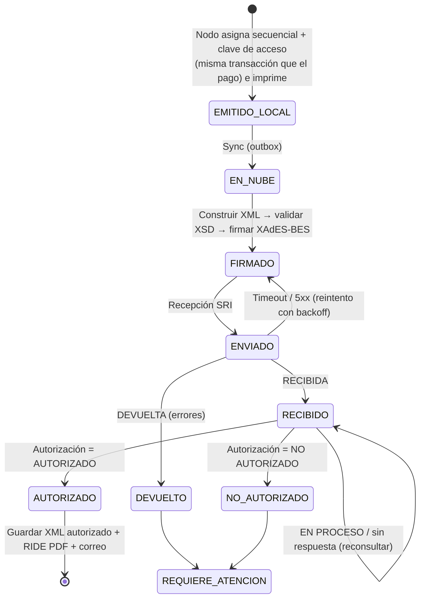

# 05 · Especificación del motor fiscal (SRI Ecuador)

> ⚖️ **Aviso de cumplimiento.** Este documento resume la operación del **esquema offline** de comprobantes electrónicos del SRI según el conocimiento disponible al redactarlo. **Antes de implementar cada parte** hay que descargar la **Ficha Técnica de Comprobantes Electrónicos Esquema Offline** vigente y los **XSD oficiales** desde el portal del SRI, guardarlos en `docs/fuentes/sri/` y usarlos como fuente de verdad. Donde haya diferencias, **gana la ficha técnica**. Los puntos marcados con 🔎 deben verificarse explícitamente.

## 1. Alcance

| Comprobante | Código | Fase |
|---|---|---|
| Factura | `01` | 5 (MVP) |
| Nota de crédito | `04` | 5 (MVP) |
| Nota de débito | `05` | Fuera de alcance |
| Comprobante de retención | `07` | Fuera de alcance (C) |
| Liquidación de compra | `03` | Fuera de alcance (C) |
| Nota de venta RIMPE (física/electrónica) | — | Depende de DP-05 |

## 2. Flujo extremo a extremo



## 3. Reparto de responsabilidades

| Paso | Dónde | Motivo |
|---|---|---|
| Asignar secuencial | **Nodo Local** | Debe funcionar sin internet; un único dueño por punto de emisión evita duplicados |
| Generar clave de acceso | **Nodo Local** | Es determinística y no requiere al SRI; va impresa en el comprobante entregado al cliente |
| Imprimir comprobante en ticket | **Nodo Local** | Inmediato |
| Construir y validar XML | **Nube** | Mismo código para todos; los XSD se actualizan centralmente |
| Firmar XAdES-BES | **Nube** | El `.p12` nunca sale de la nube (ADR-0006) |
| Enviar y consultar al SRI | **Nube** (worker) | Reintentos centralizados, monitoreo |
| RIDE PDF, correo, archivo | **Nube** | |

> **Implicación:** la **fecha de emisión** y todos los datos del comprobante quedan fijados en el Nodo Local al cobrar. La nube **no puede alterar** ningún campo que forme parte de la clave de acceso ni del contenido tributario; solo lo serializa y firma. El payload sincronizado incluye un hash del contenido para verificarlo.

## 4. Clave de acceso (49 dígitos)

| Pos. | Longitud | Campo | Ejemplo |
|---|---|---|---|
| 1-8 | 8 | Fecha de emisión `ddmmaaaa` | `24092026` |
| 9-10 | 2 | Tipo de comprobante | `01` |
| 11-23 | 13 | RUC del emisor | `1790012345001` |
| 24 | 1 | Tipo de ambiente (`1` pruebas, `2` producción) | `2` |
| 25-30 | 6 | Serie (establecimiento 3 + punto de emisión 3) | `001002` |
| 31-39 | 9 | Secuencial | `000000123` |
| 40-47 | 8 | Código numérico (libre, generado por el emisor) | `12345678` |
| 48 | 1 | **Tipo de emisión** (`1` = emisión normal) | `1` |
| 49 | 1 | Dígito verificador (módulo 11) | `7` |
| | **49** | | |

**Dígito verificador (módulo 11):**

1. Tomar los 48 dígitos anteriores.
2. De **derecha a izquierda**, multiplicar cada dígito por los factores `2, 3, 4, 5, 6, 7` en ciclo.
3. Sumar los productos: `S`.
4. `d = 11 − (S mod 11)`.
5. Si `d = 11` → `0`; si `d = 10` → `1`; en otro caso, `d`.

**Código numérico:** 8 dígitos aleatorios criptográficamente seguros (`crypto/rand`) por comprobante. No se usa un valor fijo.

**Pruebas obligatorias:** vectores de prueba con claves reales de comprobantes autorizados (anonimizadas en cuanto al RUC si fuera necesario), casos borde `d=10` y `d=11`, y una prueba de propiedades (property-based) sobre 10⁶ claves aleatorias que verifique longitud y dígito.

## 5. Secuenciales

- Cada **caja** tiene un **punto de emisión** propio (`001-001`, `001-002`…). El punto de emisión pertenece a **un único Nodo Local**.
- El secuencial se incrementa dentro de la **misma transacción SQLite** que crea el comprobante y el pago. Si la transacción falla, no se consume el número.
- Secuenciales separados por `(punto_emision, tipo_comprobante, ambiente)`.
- **Recuperación (CU-08):** al reactivar un nodo, el secuencial inicial es `max(último en la nube, último en el respaldo) + margen` (margen configurable, p. ej. 10). 🔎 Verificar si el SRI admite saltos de secuencial en el esquema electrónico y documentar el tratamiento de números no usados.
- Los puntos de emisión deben estar registrados por el contribuyente en el SRI si así lo exige la normativa vigente 🔎.

## 6. Estructura del XML (factura)

Esqueleto de referencia (la versión exacta de esquema y campos se toma del XSD oficial 🔎):

```xml
<factura id="comprobante" version="1.1.0">
  <infoTributaria>
    <ambiente>2</ambiente>
    <tipoEmision>1</tipoEmision>
    <razonSocial>…</razonSocial>
    <nombreComercial>…</nombreComercial>
    <ruc>1790012345001</ruc>
    <claveAcceso>…49 dígitos…</claveAcceso>
    <codDoc>01</codDoc>
    <estab>001</estab>
    <ptoEmi>002</ptoEmi>
    <secuencial>000000123</secuencial>
    <dirMatriz>…</dirMatriz>
    <!-- según régimen: <contribuyenteRimpe>, <agenteRetencion> -->
  </infoTributaria>
  <infoFactura>
    <fechaEmision>24/09/2026</fechaEmision>
    <dirEstablecimiento>…</dirEstablecimiento>
    <obligadoContabilidad>SI|NO</obligadoContabilidad>
    <tipoIdentificacionComprador>05</tipoIdentificacionComprador>
    <razonSocialComprador>…</razonSocialComprador>
    <identificacionComprador>…</identificacionComprador>
    <totalSinImpuestos>13.04</totalSinImpuestos>
    <totalDescuento>0.00</totalDescuento>
    <totalConImpuestos>
      <totalImpuesto>
        <codigo>2</codigo><codigoPorcentaje>4</codigoPorcentaje>
        <baseImponible>13.04</baseImponible><valor>1.96</valor>
      </totalImpuesto>
    </totalConImpuestos>
    <propina>1.30</propina>
    <importeTotal>16.30</importeTotal>
    <moneda>DOLAR</moneda>
    <pagos>
      <pago><formaPago>19</formaPago><total>16.30</total></pago>
    </pagos>
  </infoFactura>
  <detalles>
    <detalle>
      <codigoPrincipal>CEV-001</codigoPrincipal>
      <descripcion>Ceviche mixto</descripcion>
      <cantidad>1.000000</cantidad>
      <precioUnitario>13.043478</precioUnitario>
      <descuento>0.00</descuento>
      <precioTotalSinImpuesto>13.04</precioTotalSinImpuesto>
      <impuestos>
        <impuesto>
          <codigo>2</codigo><codigoPorcentaje>4</codigoPorcentaje>
          <tarifa>15</tarifa><baseImponible>13.04</baseImponible><valor>1.96</valor>
        </impuesto>
      </impuestos>
    </detalle>
  </detalles>
  <infoAdicional>
    <campoAdicional nombre="Email">cliente@correo.com</campoAdicional>
    <campoAdicional nombre="Mesa">4</campoAdicional>
  </infoAdicional>
  <!-- ds:Signature XAdES-BES se inserta aquí (enveloped) -->
</factura>
```

## 7. Catálogos (🔎 validar contra la ficha técnica vigente)

**Tipos de identificación del comprador:** `04` RUC · `05` Cédula · `06` Pasaporte · `07` Consumidor final (`9999999999999`) · `08` Identificación del exterior.

**Códigos de porcentaje de IVA (`codigo` = 2):** `0` 0 % · `2` 12 % · `3` 14 % · `4` 15 % · `5` 5 % · `6` No objeto de impuesto · `7` Exento de IVA · `8` IVA diferenciado · `10` 13 %.
*Se almacenan en la tabla versionada `tarifas_iva`, nunca hardcodeados en el código.*

**Formas de pago:** `01` Sin utilización del sistema financiero (efectivo) · `15` Compensación de deudas · `16` Tarjeta de débito · `17` Dinero electrónico · `18` Tarjeta prepago · `19` Tarjeta de crédito · `20` Otros con utilización del sistema financiero (transferencias) · `21` Endoso de títulos.

## 8. Cálculos y redondeo

1. **Precios con IVA incluido** (configurable por local): `precio_sin_iva = precio_con_iva / (1 + tarifa)`, guardado con 6 decimales.
2. Por línea: `precioTotalSinImpuesto = round2(cantidad × precioUnitario − descuento)`.
3. Por tarifa: `baseImponible = Σ precioTotalSinImpuesto` de las líneas con esa tarifa; `valor IVA = round2(base × tarifa)`.
4. **Propina legal** = `round2(10 % × Σ bases imponibles)` (sin IVA); no se grava.
5. `importeTotal = totalSinImpuestos + Σ IVA + propina` (los descuentos ya están restados en las bases).
6. **Cuadre obligatorio:** si el precio al público con IVA incluido era $15,00, el total de la factura debe ser exactamente $15,00. El algoritmo ajusta el centavo residual en la línea de mayor importe (técnica *largest remainder*) y **siempre** respeta las tolerancias de validación del SRI 🔎.
7. Redondeo: *half-up* (0,005 → 0,01). Toda la aritmética usa decimal exacto (`shopspring/decimal` en Go, `decimal.js` en TS y `decimal` en Dart).

**Pruebas obligatorias:** tabla de casos reales (precios típicos de restaurante × cantidades × descuentos × propina) comparados contra un cálculo de referencia y contra comprobantes autorizados en el ambiente de pruebas.

## 9. Firma XAdES-BES

- Firma **enveloped** sobre el nodo raíz (`Id="comprobante"`), con `ds:SignedInfo` que referencia (a) el comprobante, (b) las `xades:SignedProperties` y (c) el `ds:KeyInfo`.
- `xades:SignedProperties` incluye `SigningTime`, `SigningCertificate` (digest + issuer/serial) y `DataObjectFormat`.
- Algoritmos de canonicalización, digest y firma **según la ficha técnica** 🔎 (históricamente C14N 1.0, SHA-1 y RSA-SHA1).
- **Riesgo técnico alto (spike en la Fase 0):** en Go no existe una librería XAdES madura. Opciones:
  - **A.** Implementación propia en Go sobre una librería XML-DSig (p. ej. `goxmldsig`) más un constructor de `SignedProperties`, validada contra el SRI de pruebas.
  - **B.** Microservicio *sidecar* en Java con una librería probada para el SRI, llamado por el worker.
  - Criterio de decisión: la opción A se adopta si en el spike firma 20 comprobantes distintos y el SRI de pruebas los autoriza todos. Si no, la B. → Se registra en un ADR.
- **Lectura del `.p12`:** usar una librería PKCS#12 completa (p. ej. `software.sslmate.com/src/go-pkcs12`), ya que la de `golang.org/x/crypto/pkcs12` no soporta varios formatos emitidos por las entidades certificadoras locales. Probar con certificados de **al menos 2 entidades distintas**.

## 10. Web services del SRI (esquema offline, SOAP)

| Servicio | Pruebas | Producción |
|---|---|---|
| Recepción | `https://celcer.sri.gob.ec/comprobantes-electronicos-ws/RecepcionComprobantesOffline?wsdl` | `https://cel.sri.gob.ec/comprobantes-electronicos-ws/RecepcionComprobantesOffline?wsdl` |
| Autorización | `https://celcer.sri.gob.ec/comprobantes-electronicos-ws/AutorizacionComprobantesOffline?wsdl` | `https://cel.sri.gob.ec/comprobantes-electronicos-ws/AutorizacionComprobantesOffline?wsdl` |

🔎 Confirmar las URLs vigentes. Se guardan en configuración, no en el código.

- **Recepción** (`validarComprobante`, XML en base64) → `RECIBIDA` o `DEVUELTA` con una lista de mensajes (identificador, mensaje, información adicional, tipo).
- **Autorización** (`autorizacionComprobante`, clave de acceso) → `AUTORIZADO`, `NO AUTORIZADO` o `EN PROCESO`, con número y fecha de autorización y el XML autorizado.
- **Casos especiales** 🔎: "clave de acceso registrada" y "clave en procesamiento". En ambos casos **no** se reenvía: se pasa a consultar la autorización.
- Timeouts: conexión 10 s, respuesta 30 s. Máximo de concurrencia por tenant y global (para no saturar al SRI ni ser bloqueados).
- Se conserva la respuesta cruda del SRI en `comprobante_eventos` (sin datos sensibles adicionales).

## 11. RIDE

- **Ticket térmico (80 mm)** entregado al instante: razón social, nombre comercial, RUC, dirección matriz y del establecimiento, tipo de comprobante y número `001-002-000000123`, clave de acceso (texto + código de barras Code128 o QR), ambiente, fecha, datos del comprador, detalle, subtotales por tarifa, descuentos, IVA, propina, total, forma de pago, leyendas del régimen y la leyenda de estado de autorización 🔎 (confirmar el contenido mínimo exigido para el RIDE y la validez del formato ticket).
- **PDF A4** generado en la nube tras la autorización, con fecha y número de autorización, enviado por correo junto al XML.

## 12. Validación de identificaciones (en el cliente y en el servidor)

- **Cédula (10 dígitos):** provincia `01`-`24` o `30`; tercer dígito `< 6`; coeficientes `2,1,2,1,2,1,2,1,2` sobre los 9 primeros (restar 9 si el producto es > 9); verificador = `(10 − suma mod 10) mod 10`.
- **RUC persona natural:** cédula válida + `001`.
- **RUC sociedad privada** (tercer dígito `9`): módulo 11 con coeficientes `4,3,2,7,6,5,4,3,2`, verificador en la posición 10.
- **RUC sector público** (tercer dígito `6`): módulo 11 con coeficientes `3,2,7,6,5,4,3,2`, verificador en la posición 9.
- ⚠️ Existen RUCs de sociedades emitidos que **no** cumplen el módulo 11. Para sociedades se **advierte** pero no se bloquea; el SRI es la validación final.

## 13. Seguridad del motor fiscal

Ver `06-seguridad.md` §4: el P12 y su contraseña se cifran con envelope encryption, se descifran solo en memoria del worker durante la firma, nunca aparecen en logs y cada uso se audita.

## 14. Puntos a verificar antes de producción (checklist 🔎)

- [ ] Ficha técnica offline vigente y XSD descargados en `docs/fuentes/sri/`.
- [ ] Versión del esquema de factura y NC a usar (`1.0.0` / `1.1.0` / `2.x`).
- [ ] Plazo máximo para enviar comprobantes al SRI tras la emisión (el documento fuente dice 72 h).
- [ ] Monto máximo para consumidor final vigente.
- [ ] Contenido mínimo del RIDE y validez del formato ticket.
- [ ] Tratamiento de saltos de secuencial.
- [ ] Procedimiento vigente de anulación vs nota de crédito.
- [ ] Campos y leyendas RIMPE vigentes.
- [ ] Algoritmos de firma exigidos.
- [ ] Revisión del flujo completo por un contador o tributarista (acta en `docs/fuentes/`).
