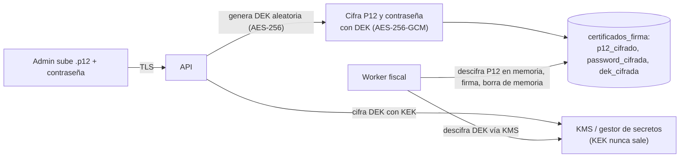

# 06 · Seguridad y protección de datos

## 1. Modelo de amenazas (resumen STRIDE)

| Amenaza | Escenario | Control principal |
|---|---|---|
| **S**uplantación | Un ex-mesero usa la app desde su casa | Dispositivo emparejado + revocación inmediata; PIN validado en el nodo (solo en la LAN) |
| **S**uplantación | Robo del teléfono del mesero | PIN obligatorio al desbloquear la pantalla; sin datos sensibles en el teléfono; revocación remota |
| **T**ampering | El cajero modifica facturas pasadas | Tablas append-only, comprobantes inmutables, NC obligatoria, auditoría con cadena de hash |
| **T**ampering | Alguien altera la SQLite local | Los datos fiscales se firman o hashean al sincronizar; la nube valida la coherencia; auditoría |
| **R**epudio | "Yo no anulé esa mesa" | Auditoría con usuario, autorizador, dispositivo y hora |
| **I**nformation disclosure | Fuga entre restaurantes | RLS en PostgreSQL + pruebas de aislamiento en el CI |
| **I**nformation disclosure | Robo del `.p12` | Envelope encryption, el P12 nunca sale de la nube, acceso mínimo |
| **I**nformation disclosure | Sniffing en el WiFi del local | TLS en la LAN; red de personal separada |
| **D**enial of service | Un cliente satura el WiFi | VLAN o SSID separado (requisito de instalación); QoS recomendado |
| **D**enial of service | Fuerza bruta de PINs | Rate limit y bloqueo por usuario y dispositivo |
| **E**levation of privilege | Un mesero hace acciones de admin | RBAC validado **en el servidor** (nodo y nube), nunca solo en la UI |

## 2. Autenticación

| Actor | Mecanismo | Duración |
|---|---|---|
| Admin / Cajero (web) | Correo + contraseña (Argon2id), 2FA TOTP opcional u obligatorio según plan | Access 15 min + refresh rotativo 7 días (cookie HttpOnly) |
| Mesero / Cajero (app, POS en el local) | Dispositivo emparejado + PIN (4-6 dígitos) validado en el nodo | Sesión por turno (máx. 12 h); re-PIN al bloquear o tras inactividad |
| Dispositivo | Par de llaves en el Keystore/Keychain; desafío-respuesta firmado | Hasta su revocación |
| Nodo Local | Certificado de cliente (mTLS) o llave ed25519 emitida al activar | Rotación anual automática |
| Super Admin | Contraseña + 2FA **obligatorio** + lista de IPs permitidas opcional | Sesión corta (1 h) |

**PIN:**

- Se almacena como `Argon2id(HMAC-SHA256(pepper, pin || user_id))`. El *pepper* vive en el gestor de secretos de la nube y en el almacén seguro del nodo (DPAPI en Windows).
- Se valida solo en el nodo o en la nube; **nunca** en el teléfono.
- 5 intentos → bloqueo de 5 min por usuario y dispositivo; 20 intentos por dispositivo en 10 min → alerta al Admin.

## 3. Autorización

- RBAC + permisos granulares (`docs/requisitos/README.md` §3).
- Todo endpoint declara el permiso requerido y existe un middleware único que lo verifica. Hay pruebas que recorren **todas** las rutas y fallan si alguna no declara permiso.
- La autorización con PIN de supervisor genera un token de un solo uso ligado a la acción concreta.

## 4. Gestión de secretos y del certificado P12

- **KEK** (llave maestra) en un KMS (AWS KMS, Azure Key Vault o equivalente); nunca en variables de entorno planas ni en el repositorio.
- **DEK** por certificado, rotada si se re-sube el certificado.
- La contraseña del P12 se **cifra** (reversible, porque es necesaria para usar el certificado). **No** se *hashea* (corrige el error X-01).
- Solo el worker fiscal tiene permiso de descifrado (IAM de mínimo privilegio). La API puede cifrar, pero no descifrar.
- Cada descifrado queda registrado en un log de acceso.
- Secretos de la aplicación (DB, SMTP, pasarela, pepper): en el gestor de secretos, inyectados en tiempo de ejecución. Escaneo de secretos en el CI (gitleaks) y protección de push de GitHub.

## 5. Seguridad de red y transporte

- TLS 1.2+ en todo el tráfico externo; HSTS en los dominios web.
- **LAN:** el nodo sirve HTTPS/WSS con un certificado emitido por la CA interna de la plataforma al activarse; la app lo ancla (*pinning*) al emparejar. La caja web accede por `https://<nodo>.local` con ese certificado instalado como confiable durante la instalación (🔎 validar la experiencia en navegadores; alternativa: dominio propio con DNS local).
- Requisito de instalación: red de personal separada de la red de clientes (VLAN o SSID independiente con aislamiento).
- La API de la nube tiene rate limiting por IP, por tenant y por token.

## 6. Seguridad de la aplicación

- Validación de entrada en el servidor con esquemas generados desde los contratos.
- Consultas parametrizadas (sqlc/pgx); cero SQL concatenado.
- Cabeceras de seguridad (CSP estricta, `X-Content-Type-Options`, `frame-ancestors`).
- Subida de imágenes: validación de tipo real, re-codificación (elimina EXIF y *payloads*), límite de tamaño y URLs firmadas.
- Dependencias: Dependabot o Renovate + `govulncheck`, `npm audit`/osv-scanner, `flutter pub outdated`.
- SAST en cada PR (CodeQL o Semgrep).
- Pentest externo antes del lanzamiento comercial (Fase 10).

## 7. Protección de datos personales (LOPDP, Ecuador)

**Roles:** el **restaurante** es el *responsable del tratamiento* de los datos de sus clientes y empleados; la plataforma SaaS es el *encargado del tratamiento*. Esto se formaliza en un **Acuerdo de Tratamiento de Datos** firmado con cada tenant.

| Dato | Titular | Finalidad | Base legal | Retención |
|---|---|---|---|---|
| Identificación, nombre, dirección y correo del comprador | Comensal | Emitir el comprobante electrónico | Obligación legal (tributaria) | Plazo tributario (≥ 7 años) 🔎 |
| Correo y teléfono para futuras compras (autocompletar) | Comensal | Agilizar la facturación | Consentimiento | Hasta que se revoque |
| Nombre, foto, PIN, registros de actividad | Empleado | Operación y control interno | Relación laboral / interés legítimo | Relación laboral + plazo de auditoría |
| Datos del dueño y de facturación del SaaS | Cliente SaaS | Contrato | Ejecución contractual | Contrato + plazo tributario |

**Medidas:**

1. Minimización: el mesero no ve datos de los compradores; los logs no contienen datos personales.
2. Cifrado en tránsito y en reposo (discos cifrados y respaldos cifrados con AES-256-GCM).
3. Derechos ARCO+ (acceso, rectificación, eliminación, oposición, portabilidad): proceso documentado. La eliminación de un comprador **no** aplica a comprobantes emitidos (obligación tributaria); en esos casos se bloquea el uso para autocompletar.
4. Registro de actividades de tratamiento y evaluación de impacto (EIPD) antes del lanzamiento comercial.
5. **Transferencia internacional:** si la nube está fuera de Ecuador, debe evaluarse y documentarse conforme a la LOPDP (cláusulas contractuales, nivel adecuado de protección) 🔎 → **DP-01**.
6. Procedimiento de notificación de brechas a la autoridad y a los afectados en los plazos que establezca la ley 🔎.
7. Política de privacidad y términos visibles en el backoffice, el menú QR y la app.

## 8. Seguridad del Nodo Local

- Corre como servicio con un usuario de privilegios mínimos.
- La base SQLite contiene datos personales: se cifra el volumen o la base (SQLCipher o cifrado de disco del SO, a decidir en un ADR de la Fase 2) y siempre se cifran los respaldos.
- Binarios firmados y actualizaciones verificadas (ver `03-arquitectura.md` §8).
- La página de estado local no expone datos sensibles y requiere PIN de Admin para las acciones.

## 9. Respuesta a incidentes

- Runbooks en `docs/runbooks/` (Fase 6): nodo caído, SRI caído, fuga de credenciales, certificado comprometido, revocación masiva de dispositivos, restauración de respaldo.
- Contacto de seguridad (`security@<dominio>`) y archivo `SECURITY.md` en el repositorio.
