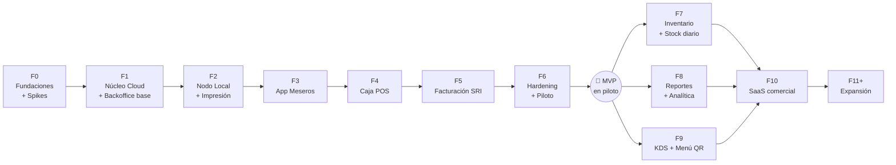

# 07 · Plan de implementación por fases

## 1. Principios

1. **Primero el riesgo.** Lo que puede hacer fracasar el proyecto (firma SRI, impresión, sincronización) se prueba en la Fase 0, antes de construir encima.
2. **Cada fase termina en algo demostrable** y con su *Definition of Done* cumplida. No se empieza una fase con la anterior a medias.
3. **MVP pilotable** al final de la Fase 6: un restaurante real opera salón, caja y facturación con el sistema.
4. **Todo cambio de código va con sus pruebas y su documentación** (ver `08-calidad-y-cicd.md` y `11-convenciones-de-codigo.md`).
5. Las fechas se estiman en **semanas de equipo**; ver §4.

## 2. Mapa de fases

## 3. Detalle por fase

### Fase 0 · Fundaciones y spikes de riesgo

**Objetivo:** dejar el terreno listo y **eliminar las incógnitas técnicas** mayores.

| Entregable | Detalle |
|---|---|
| Decisiones | Responder `10-decisiones-pendientes.md`; pasar los ADR 0001-0008 a *Aceptado* |
| Monorepo | Estructura de `03-arquitectura.md` §12, licencias, `CODEOWNERS`, plantillas de PR e issue, `SECURITY.md` |
| Tooling | Go (golangci-lint, gofumpt), TS (ESLint, Prettier, Vitest), Flutter (very_good_analysis), pre-commit, Conventional Commits |
| CI base | GitHub Actions: lint + test + build por app, con filtros por ruta |
| Entorno local | `docker compose`: PostgreSQL, MinIO, Mailpit, simulador de impresora ESC/POS (TCP 9100 → PNG/texto), stub del SRI |
| **Spike SRI** | Clave de acceso + XML + firma XAdES-BES en Go + envío al **ambiente de pruebas del SRI** → **20 facturas autorizadas**, con certificados de 2 entidades distintas. Resultado: ADR de la librería o enfoque de firma |
| **Spike impresión** | Go → ESC/POS a una impresora térmica real por TCP y USB (Windows): texto, negritas, tamaños, corte, código de barras/QR y apertura de cajón. Medir la latencia |
| **Spike sync** | Prototipo del outbox SQLite → API → PostgreSQL con cortes de red simulados (toxiproxy): 0 pérdidas y 0 duplicados en 10 000 eventos |
| Diseño UX | Wireframes de baja fidelidad: mapa de mesas, toma de pedido, cobro, división de cuenta, cierre ciego. Validación con 2 meseros y 1 cajero reales |

**DoD:** los tres spikes tienen un resultado documentado en ADR; el CI está en verde; `make dev` levanta todo el entorno local en un comando.

---

### Fase 1 · Núcleo Cloud y Backoffice base

**Requisitos:** RF-01-01, 02, 03, 04 · RF-03-01 (cuadrícula) · catálogo (base de RF-03-06) · RNF-20.

| Entregable | Detalle |
|---|---|
| API Cloud | Esqueleto Go: config, logging, errores estándar (RFC 9457), health, OpenAPI, middleware de tenant + RLS, auth |
| DB | Migraciones: tenants, locales, usuarios, permisos, catálogo, modificadores, tarifas IVA, zonas, mesas, estaciones |
| Auth web | Login, refresh, recuperación de contraseña, primer cambio de contraseña obligatorio |
| Backoffice | Shell de la app (navegación, diseño, estados vacíos), CRUD de productos, categorías, modificadores, mesas y zonas, personal |
| Imágenes | Subida con redimensionado a WebP y URLs firmadas |
| Super Admin | CLI o pantalla mínima para crear tenants |

**DoD:** un Admin crea su menú completo y su personal; la prueba de aislamiento entre tenants pasa para todas las tablas; el despliegue a `dev` es automático.

---

### Fase 2 · Nodo Local e impresión

**Requisitos:** RF-02-01 … 06, 08, 09 (parcial).

| Entregable | Detalle |
|---|---|
| Nodo | Binario Go como servicio de Windows, SQLite WAL, migraciones edge, activación por código, página de estado |
| Sync | Catálogo y configuración Nube → Nodo (inbox + cursores); telemetría de salud |
| Impresión | Descubrimiento (mDNS + escaneo 9100 + USB), estaciones, ruteo drag & drop en el backoffice, colas persistentes por estación, detección de fallos, reimpresión |
| Tiempo real | Hub WebSocket, contratos de eventos, TLS en la LAN |
| Instalador | MSI firmado |

**DoD:** con el backoffice se configura "Bebidas → Bar, Platos → Cocina"; un pedido simulado por la API del nodo imprime en 2 impresoras en paralelo con p95 ≤ 1,5 s; al desconectar una impresora, el trabajo se conserva y se imprime al volver.

---

### Fase 3 · App de meseros

**Requisitos:** RF-01-05, 06 · RF-03-02 … 10.

| Entregable | Detalle |
|---|---|
| App Flutter | Emparejamiento por QR, cuadrícula de personal, login por PIN, bloqueo por inactividad |
| Salón | Mapa en vivo, bloqueo pesimista con heartbeat, transferencias y uniones |
| Pedido | Catálogo local (drift), búsqueda difusa, modificadores, notas por línea, tiempos, envío idempotente, cola "Pendiente de envío" |
| Pre-cuenta | Impresión en caja |
| UX | Estilo Cupertino, swipe-to-delete, háptica, bottom tabs, modo oscuro |

**DoD:** 8 dispositivos simultáneos contra un nodo sin internet: 0 platos duplicados, 0 colisiones de mesa (test de concurrencia Go + prueba manual guiada); la búsqueda p95 ≤ 50 ms en el móvil de referencia.

---

### Fase 4 · Caja POS

**Requisitos:** RF-04-01 … 10 · RF-01-07 · RF-02-07 · RF-08-06 (registro).

| Entregable | Detalle |
|---|---|
| POS web | Servido por el nodo; mesas y órdenes, cobro "Zero-Click", billetes dinámicos, pagos mixtos, atajos de teclado |
| Operación | Jornadas, turnos, movimientos de caja, cierre ciego y Cierre Z inmutable |
| Cuentas | División por ítems, fracciones y partes iguales |
| Otros | Descuentos, cortesías, propina legal, autorización con PIN de supervisor, auditoría |
| Clientes | Búsqueda en cascada (local → nube), validación de cédula y RUC |

**DoD:** suite Cypress del flujo de cobro y división en verde; cuadre al centavo en 1 000 escenarios aleatorios de división (property-based); el Cierre Z coincide con la suma de los pagos en todas las pruebas.

> En esta fase el cobro emite un **documento interno** (sin valor fiscal) como marcador; la Fase 5 lo reemplaza por el comprobante electrónico.

---

### Fase 5 · Facturación electrónica SRI

**Requisitos:** RF-05-01 … 09 · RF-04-11 · RF-08-02 (básicos).

| Entregable | Detalle |
|---|---|
| Nodo | Puntos de emisión, secuenciales atómicos, clave de acceso, impresión del comprobante |
| Nube | Worker fiscal (cola sobre PostgreSQL), XML + XSD, firma, recepción, autorización, backoff, estados |
| Onboarding fiscal | Asistente de carga del P12 con envelope encryption, régimen, ambientes |
| Salidas | RIDE PDF, correo con XML + PDF, bóveda, nota de crédito |
| Alertas | Pendientes más de 12 h, certificado por vencer, errores del SRI |
| Reportes básicos | Ventas del día y por periodo, Cierres Z, exportación Excel de ventas |

**DoD:** 200 comprobantes (facturas + NC) autorizados en el ambiente de pruebas cubriendo todas las tarifas, consumidor final, propina, descuentos y pagos mixtos; caída del SRI simulada 2 h sin pérdida; revisión del contador firmada (checklist `05` §14).

---

### Fase 6 · Hardening y piloto

**Requisitos:** RF-02-10, 11 · RNF-10 … 15, 50 … 54.

| Entregable | Detalle |
|---|---|
| Resiliencia | Respaldos cifrados, restauración probada (CU-08), auto-update con rollback, purga local |
| Observabilidad | Logs, métricas, trazas, alertas y dashboard de la salud de los nodos |
| Rendimiento | Pruebas de carga k6 (escenario de referencia ×2) |
| Seguridad | Revisión de amenazas, escaneo de dependencias, prueba de aislamiento, simulacro de revocación |
| Operación | Runbooks, kit de instalación, manual de usuario corto (1 página por rol), plan de contingencia en papel |
| Piloto | 1 restaurante en **paralelo** 14 días → producción SRI en ese restaurante |

**DoD (= MVP):** el piloto opera 2 fines de semana completos en producción con 0 pérdidas de datos, 0 comprobantes perdidos y ≥ 99 % de autorizaciones en menos de 1 h (fuera de caídas del SRI); feedback registrado y priorizado.

---

### Fase 7 · Inventario y stock diario

**Requisitos:** RF-06-01 … 10.

**DoD:** la descarga por receta es exacta al 4.º decimal en la suite E2E; la carrera de cupos (2 disponibles, 3 solicitudes) → 2 éxitos en el 100 % de 1 000 ejecuciones; el reporte diario de cupos cuadra.

### Fase 8 · Reportes, analítica y auditoría

**Requisitos:** RF-08-01 … 07.

**DoD:** dashboard en vivo con latencia ≤ 5 s; reparto de propinas cuadra al centavo; matriz de fugas validada por el dueño piloto.

### Fase 9 · KDS y menú QR

**Requisitos:** RF-07-01 … 03 · RF-03-12.

**DoD:** KDS operando en el piloto; "Plato listo" llega al mesero en ≤ 1 s; el menú QR refleja "Agotado" en ≤ 5 s con internet.

### Fase 10 · SaaS comercial

**Requisitos:** RF-09-01 … 04 · RF-01-08 · RF-05-10 · RNF-34.

**DoD:** un restaurante nuevo se registra, paga, instala y factura **sin intervención** del equipo; pentest externo sin hallazgos críticos abiertos; términos, privacidad y acuerdo de tratamiento de datos publicados.

### Fase 11+ · Expansión (backlog priorizable)

Multi-sucursal y traslados (plan Pro) · nodo en *hot standby* · ATS · notas de venta RIMPE · integración con datafonos · delivery (API abierta, PedidosYa…) · bot de WhatsApp · auto-pedido QR · onboarding con IA desde una foto de la carta · reservas · fidelización.

## 4. Estimación orientativa

> Son rangos para planificar, no compromisos. Se recalibran al cerrar la Fase 0 con datos reales de velocidad.

| Fase | 1 dev full-stack senior | Equipo de 3 (backend Go, Flutter, web) |
|---|---|---|
| F0 | 4-6 sem | 3-4 sem |
| F1 | 5-7 sem | 3-4 sem |
| F2 | 5-7 sem | 3-5 sem |
| F3 | 6-8 sem | 4-5 sem |
| F4 | 6-8 sem | 4-5 sem |
| F5 | 6-9 sem | 4-6 sem |
| F6 | 4-6 sem | 3-4 sem |
| **MVP (F0-F6)** | **≈ 9-12 meses** | **≈ 5-7 meses** |
| F7-F10 | +6-9 meses | +4-6 meses |

El documento fuente estimaba 5 meses para **todo**; ese plazo solo es comparable con el MVP y con un equipo de 3 personas.

## 5. Matriz de trazabilidad (requisito → fase)

| Módulo | F1 | F2 | F3 | F4 | F5 | F6 | F7 | F8 | F9 | F10 |
|---|---|---|---|---|---|---|---|---|---|---|
| RF-01 Plataforma | 01-04 | | 05-06 | 07 | | | | | | 08 |
| RF-02 Nodo/Impresión | | 01-06, 08-09 | | 07 | | 10-11 | | | | |
| RF-03 Salón | 01 | | 02-10 | 11 | | | | | 12 | |
| RF-04 Caja | | | | 01-10 | 11 | | | | | |
| RF-05 SRI | | | | | 01-09 | | | | | 10 |
| RF-06 Inventario | | | | | | | 01-10 | | | |
| RF-07 KDS/QR | | | | | | | | | 01-03 | |
| RF-08 Reportes | | | | 06* | 02* | | | 01-07 | | |
| RF-09 SaaS | | | | | | | | | | 01-04 |

\* parcial (registro de auditoría en F4; reportes básicos en F5).

## 6. Gestión del trabajo

- **Backlog en GitHub Issues + Projects:** una *épica* por fase y un *issue* por requisito o grupo de criterios, con la etiqueta del ID (`RF-03-03`).
- **Iteraciones de 2 semanas** con demo al final.
- Cada PR referencia el requisito que implementa (`Implementa RF-03-03`) y marca los criterios cubiertos.
- La documentación se actualiza **en el mismo PR** cuando la implementación cambia una decisión.
