# 08 · Estrategia de calidad, pruebas y CI/CD

## 1. Pirámide de pruebas por componente

| Nivel | Cloud API / Workers (Go) | Nodo Local (Go) | App Meseros (Flutter) | Web POS/Backoffice (React) |
|---|---|---|---|---|
| Unitarias | `go test` + tablas de casos; property-based (`rapid`) para dinero, clave de acceso y división | Igual | `flutter test` (lógica, providers) | Vitest + Testing Library |
| Integración | testcontainers (PostgreSQL real), stub del SRI | SQLite real en disco temporal, simulador de impresora | drift en memoria, mock del nodo | MSW (mock de API) |
| Contrato | Validación contra OpenAPI y JSON Schema en ambos lados | Igual | Cliente generado | Cliente generado |
| Concurrencia | `go test -race`; carrera de bloqueos y reservas con N goroutines | **Obligatorio** para bloqueos, cupos, secuenciales | — | — |
| E2E | — | — | `integration_test` / Patrol sobre emulador | **Cypress** (flujos de caja y backoffice) |
| Carga | k6 contra la API y el sync | k6 contra el nodo (WS + HTTP) | — | — |
| Resiliencia | toxiproxy (latencia, cortes) entre nodo ↔ nube ↔ SRI | Kill -9 del proceso a mitad de una transacción → verificar integridad | Modo avión a mitad de un pedido | — |

> **Corrección al documento fuente:** Cypress **no** prueba la app Flutter. La prueba de "dos meseros tocan la misma mesa al mismo milisegundo" se hace **a nivel de backend** (determinística y repetible), no desde la UI.

## 2. Pruebas críticas obligatorias (no se despliega si fallan)

| ID | Prueba | Requisito |
|---|---|---|
| QA-01 | 100 solicitudes de bloqueo simultáneas sobre una mesa → exactamente 1 éxito | RF-03-03 |
| QA-02 | N reservas simultáneas con cupo K → exactamente K éxitos | RF-06-09 |
| QA-03 | Secuencial: 10 000 cobros concurrentes → 0 duplicados, 0 huecos | RF-05-02 |
| QA-04 | Clave de acceso: vectores conocidos + property-based | RF-05-02 |
| QA-05 | Cuadre al centavo: 10 000 facturas aleatorias (precios, cantidades, descuentos, propina, división) | RF-04-06, RF-05-06 |
| QA-06 | Aislamiento de tenants: para **cada** tabla con `tenant_id`, el tenant A no lee ni escribe los datos de B | RNF-20 |
| QA-07 | Sync: 10 000 eventos con cortes aleatorios → 0 pérdidas y 0 duplicados | §5 de arquitectura |
| QA-08 | Idempotencia: reenviar la misma comanda 5 veces → 1 sola comanda | RF-03-04 |
| QA-09 | Kardex: venta de recetas anidadas → saldo exacto al 4.º decimal | RF-06-05 |
| QA-10 | Inmutabilidad: UPDATE/DELETE en tablas append-only → error de la base de datos | RF-08-06 |
| QA-11 | Todas las rutas de la API declaran permiso | §3 de seguridad |
| QA-12 | XML generado válido contra el XSD oficial para todos los casos de QA-05 | RF-05-02 |

## 3. Pipelines (GitHub Actions)

```mermaid
flowchart LR
    PR["Pull Request"] --> L["Lint + format<br/>(por app afectada)"]
    L --> U["Unit + integración<br/>+ race"]
    U --> C["Contratos<br/>(generación sin diff)"]
    C --> S["Seguridad:<br/>gitleaks · govulncheck · osv · CodeQL"]
    S --> B["Build<br/>(binarios, imágenes, web, APK)"]
    B --> E["E2E Cypress<br/>(entorno efímero)"]
    E --> OK{"¿Todo verde?"}
    OK -->|sí| M["Merge a main"]
    M --> D1["Deploy dev (auto)"]
    D1 --> D2["Deploy staging (auto)<br/>+ k6 smoke"]
    D2 --> D3["Deploy prod<br/>(aprobación manual, tag semver)"]
```

- **Filtros por ruta:** un cambio en `apps/waiter-app/` no ejecuta el pipeline de Go, salvo que toque `contracts/`.
- **Ramas:** *trunk-based*: `main` siempre desplegable, ramas cortas `feat/…`, `fix/…`; merge con squash.
- **Protección de `main`:** PR obligatorio, CI en verde, 1 revisión (o revisión automatizada si el equipo es de 1), sin push directo.
- **Versionado:** SemVer por app (`edge-node@1.4.0`), changelog generado desde Conventional Commits.
- **Migraciones de base de datos:** se ejecutan antes de desplegar la nueva versión y siguen el patrón *expand → migrate → contract* (sin cambios destructivos en el mismo despliegue).
- **Despliegue sin caída:** rolling o blue-green con *health checks*; rollback con un comando.
- **Nodo Local:** los artefactos firmados se publican en el canal `interno`; la promoción a `piloto` → `estable` es manual.

## 4. Definition of Done (para toda historia o PR)

- [ ] Los criterios de aceptación del requisito tienen pruebas automatizadas.
- [ ] Lint, formato y tipado sin errores; cobertura del paquete ≥ umbral (RNF-50).
- [ ] Sin secretos, sin `TODO` sin issue asociado, sin código muerto.
- [ ] Los contratos (OpenAPI/eventos) están actualizados y los clientes regenerados.
- [ ] Las migraciones son reversibles o documentan por qué no.
- [ ] Los logs y errores siguen la convención y no contienen datos personales.
- [ ] Documentación actualizada (`docs/`) si cambió el comportamiento, un modelo o una decisión.
- [ ] Probado manualmente en el entorno local con el simulador de impresora (si aplica).
- [ ] Revisión de código aprobada.

## 5. Gestión de defectos

| Severidad | Ejemplo | Respuesta |
|---|---|---|
| S1 Crítico | Pérdida de datos, comprobante duplicado, fuga entre tenants, caja bloqueada en producción | Hotfix inmediato; post-mortem obligatorio |
| S2 Alto | Impresión fallida sin reintento, cálculo de IVA erróneo | Próximo release (≤ 48 h) |
| S3 Medio | Error de UI con alternativa | Siguiente iteración |
| S4 Bajo | Cosmético | Backlog |

Todo bug S1/S2 corregido debe venir con una **prueba de regresión** que lo reproduzca.
