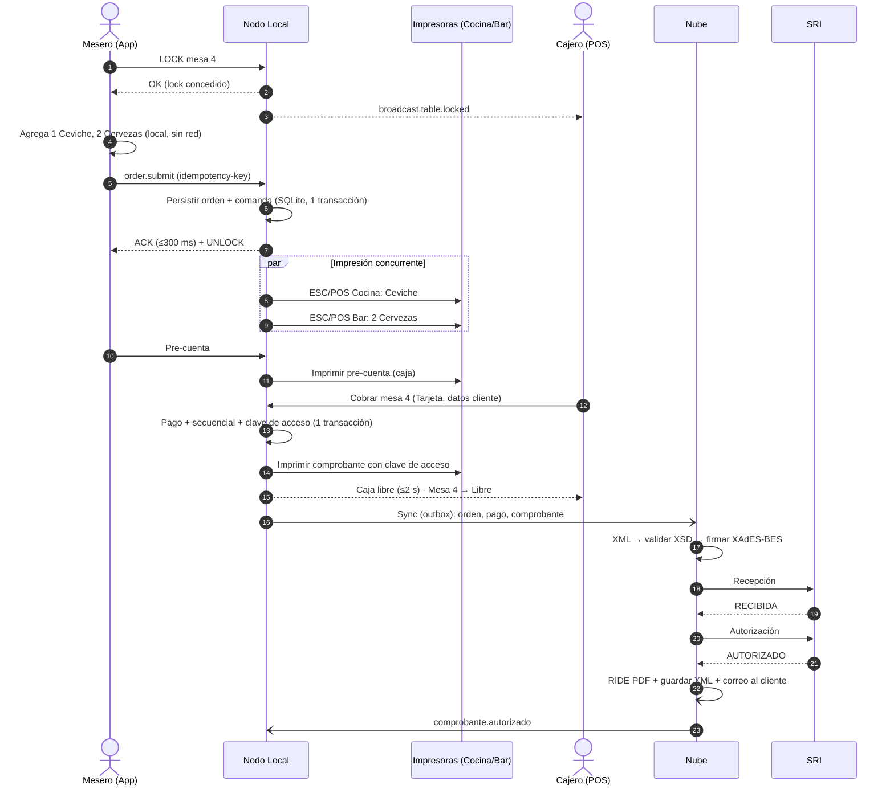

# Casos de uso

## CU-01 · Atención completa en salón (camino feliz)

- **Actores:** Mesero, Nodo Local, Cocina/Bar, Cajero, Nube, SRI
- **Precondiciones:** jornada abierta, turno de caja abierto, catálogo sincronizado, impresoras operativas, dispositivo emparejado.
- **Requisitos:** RF-03-02, 03, 04, 06, 07, 09 · RF-02-04 · RF-04-03, 05 · RF-05-02

**Flujos alternativos:**

- **A1 · Impresora sin papel:** el nodo detecta el fallo, conserva el trabajo en cola, alerta al cajero y al mesero (RF-02-05) y permite redirigir la cola. Al reponer papel, reimprime automáticamente.
- **A2 · Sin internet:** los pasos hasta "Caja libre" son idénticos. La sincronización y la autorización quedan en cola hasta que vuelve la conexión.
- **A3 · Nodo inalcanzable desde el celular:** la orden queda "Pendiente de envío" en el teléfono y se reintenta sola (RF-03-04).
- **A4 · Mesa bloqueada por otro mesero:** la app muestra "Editando: Ana" y no deja entrar (RF-03-03).

## CU-02 · División de cuenta por ítems

- **Actor:** Cajero (o mesero con permiso)
- **Requisitos:** RF-04-06
1. El cajero abre la orden de la mesa y elige "Dividir cuenta".
2. Crea 4 cuentas (`[+]`) y arrastra las líneas a cada una. Una pizza se divide en 3 partes (fracción).
3. Confirma. El nodo crea las cuentas de forma atómica.
4. Cobra cada cuenta con su método y cliente. Cada una emite su propio comprobante.
5. Al pagarse la última cuenta, la orden se cierra y la mesa se libera.

- **Alternativo · Partes iguales:** se ingresa "4 personas", se generan 4 cuentas iguales (el residuo de centavos va a la última) y cada una puede pagarse con un método distinto.
- **Excepción · Cancelación a mitad:** si ya hay cuentas pagadas, solo pueden reagruparse las cuentas no pagadas.

## CU-03 · Facturación con caída del SRI

1. El cajero factura normalmente (CU-01, pasos de cobro).
2. La nube recibe el comprobante, pero el SRI responde con timeout.
3. El worker reencola con backoff exponencial (1, 2, 5, 15, 30 min…).
4. La bóveda muestra "Enviado – esperando SRI".
5. Si pasan 12 h sin autorización → alerta al dueño.
6. Cuando el SRI vuelve, se autoriza, se genera el RIDE y se envía el correo. No hace falta ninguna acción humana.

## CU-04 · Comprobante DEVUELTO / NO AUTORIZADO

1. El SRI devuelve errores de validación (p. ej. RUC del comprador inválido).
2. El comprobante pasa a `REQUIERE_ATENCION` con un mensaje comprensible.
3. El Admin corrige el dato permitido (según normativa) y se genera un **nuevo** comprobante con un nuevo secuencial y una nueva clave de acceso; el original queda registrado como no autorizado. **Ver DP-07** sobre el tratamiento exacto según la ficha técnica.

## CU-05 · Cierre de turno ciego

1. El cajero pulsa "Cerrar turno". La pantalla **no** muestra lo esperado.
2. Cuenta el efectivo por denominación y declara los totales de tarjeta y transferencias.
3. El nodo calcula las diferencias y genera el Cierre Z inmutable.
4. Imprime el Cierre Z, lo sincroniza y la nube envía el PDF al dueño.
5. Si la diferencia supera el umbral → alerta crítica.

## CU-06 · Agotamiento y recarga de un plato del día

1. Por la mañana el chef habilita "Seco de pollo: 30".
2. Los meseros venden; cada adición al carrito reserva una unidad (RF-06-09).
3. Al llegar a 0, todos los dispositivos y el menú QR muestran "Agotado".
4. Sale una olla nueva: el cajero pulsa `[+]` → 30 → Confirmar.
5. En ≤ 1 s el plato vuelve a estar disponible en todos los dispositivos. La recarga queda auditada.

## CU-07 · Emparejar un dispositivo nuevo y dar de alta un mesero

1. El Admin crea "Carlos", PIN 8899 (10 s).
2. En la tablet: abrir la app → escanear el QR que muestra el backoffice.
3. La tablet queda ligada al local y muestra la cuadrícula del personal.
4. Carlos toca su foto → PIN → toma pedidos.

## CU-08 · Recuperación ante la pérdida de la PC de caja

1. La PC se daña. Mientras tanto, los meseros **no pueden** enviar comandas (el nodo es obligatorio). Plan de contingencia: comandas en papel (ver `03-arquitectura.md` §7).
2. En otra PC: instalar el Nodo Local → ingresar un nuevo código de activación.
3. La nube revoca el nodo anterior, entrega el estado sincronizado y el último respaldo cifrado.
4. El nodo reconstruye su base, recupera los secuenciales (el mayor entre la nube y el respaldo, más un margen de seguridad configurable) y vuelve a operar en ≤ 15 min.
5. Los dispositivos redescubren el nodo por mDNS.
