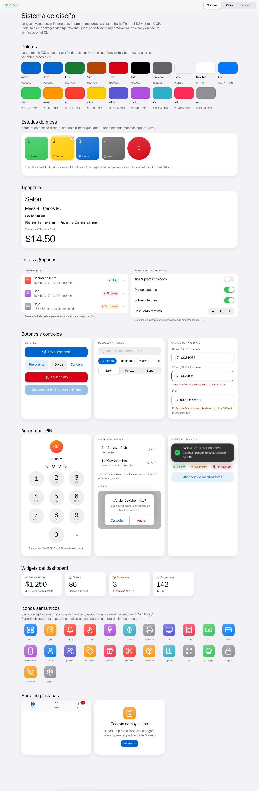

# @restpos/ui

Sistema de diseño estilo iOS para las webs (caja, backoffice, KDS, menú QR). Ticket **F0-12**.

```
packages/design/tokens.json  ─┐                 ┌─ src/tokens.css      variables --rp-* (claro/oscuro)
packages/design/icons.json   ─┴─ make tokens ──►├─ src/tailwind.css    @theme de Tailwind v4
                                                ├─ src/tokens.ts       tipos, iconos semánticos
                                                └─ ../../dart/restpos_ui/lib/src/tokens.g.dart
```

`make tokens` falla si algún texto no cumple **WCAG AA** en claro u oscuro. El CI ejecuta `make tokens-check`.

## Uso

```css
@import "tailwindcss";
@import "@restpos/ui/tokens.css";
@import "@restpos/ui/components.css";
@import "@restpos/ui/tailwind.css"; /* bg-surface, text-label-secondary, rounded-widget… */
```

```ts
import { icons, mesa, formatMoney } from "@restpos/ui";
formatMoney("1250.5"); // "$1,250.50", sin pasar por float
```

## Reglas

1. **Nada de colores literales en pantallas.** Usa las variables (`var(--rp-color-accent)`) o las clases de Tailwind generadas.
2. **Tintes de iOS solo para fondos, iconos y mosaicos.** Para texto usa `accent`, `successText`, `warningText`, `dangerText`: son las versiones que cumplen AA.
3. **Iconos por nombre semántico** (`icons.cocina`), nunca por el nombre de Lucide. Así web y app muestran el mismo dibujo.
4. **Objetivos táctiles ≥ 48 px** y foco visible por teclado (la caja se usa solo con teclado, RF-04-03).
5. **Sin `alert()`/`confirm()`**: usa `.rp-alert` dentro de la página.
6. **Modo oscuro** automático por `prefers-color-scheme`, forzable con `data-theme="dark|light"` en `<html>`.

## Componentes (`components.css`)

| Clase | Qué es |
|---|---|
| `rp-navbar`, `rp-large-title` | Barra de cristal y título grande que se contrae al hacer scroll |
| `rp-group`, `rp-cell`, `rp-section-header/footer` | Listas agrupadas con separadores con sangría |
| `rp-app-icon` (`--tint`) | Icono de app en cuadrado redondeado con degradado |
| `rp-btn--primary/tinted/gray/plain/destructive` | Botones |
| `rp-segmented`, `rp-toggle`, `rp-stepper`, `rp-chip` | Controles |
| `rp-search`, `rp-field` (`data-invalid`) | Campos con error y advertencia |
| `rp-keypad`, `rp-key`, `rp-pin-dots` (`data-error` sacude) | Teclado de PIN y montos |
| `rp-mesa` (`data-estado`) | Mosaicos de mesa: libre, ocupada, porPagar, bloqueada, demorada |
| `rp-widget` | Widgets del dashboard |
| `rp-tabbar`, `rp-tab`, `rp-badge` | Barra de pestañas con contador |
| `rp-sheet`, `rp-scrim`, `rp-alert`, `rp-toast` | Hoja modal, alerta y notificación |
| `rp-swipe` | Fila con acción al deslizar |
| `rp-status`, `rp-conn` | Píldoras de estado e indicador 🟢 🟡 🔴 de conexión |
| `rp-empty` | Estado vacío con acción principal |

Guía de estilo viva: `make ui-docs` → http://localhost:8095/docs/


